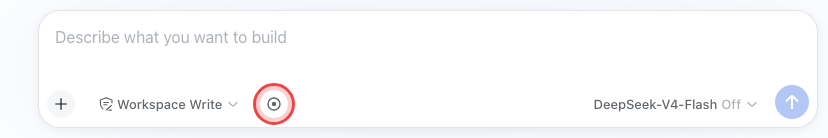
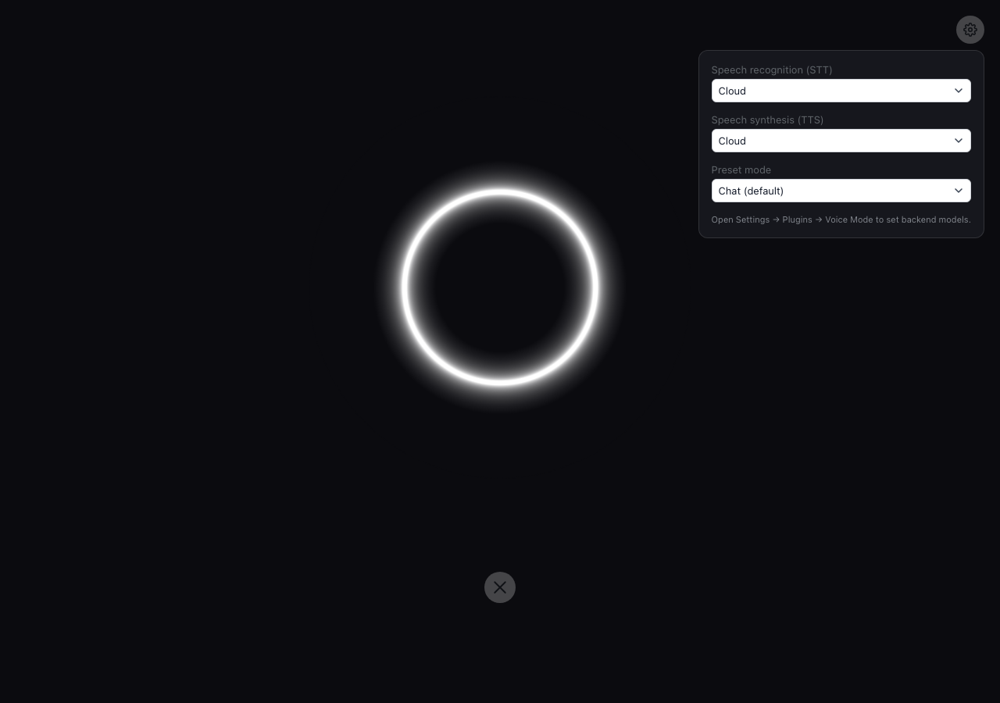
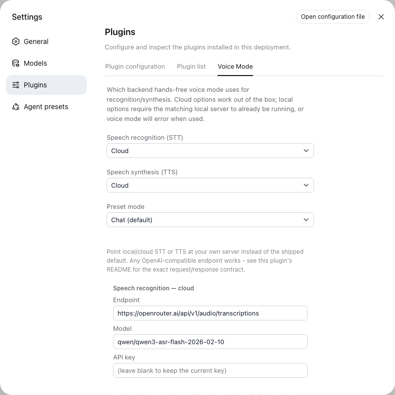

# DSH | dsh-plugin-voice-loop | Full-screen hands-free voice conversations

Voice Mode turns the composer into a full-screen, hands-free loop: tap once, talk, and the agent listens, transcribes, replies, and speaks back.

- **Interrupt anytime.** Just start talking - it stops (a real cancel, not just muting) and listens.
- **Adapts to your room.** No sensitivity slider - it tracks the room's own noise floor automatically.
- **Chat or Task preset.** Chat is fast, casual Q&A with reasoning off; Task is the full agent - tools, research, multi-step work.
- **Local or cloud, per direction.** STT and TTS each choose independently, and both point at a fully configurable endpoint - never locked to the shipped default.
- **Hot-swappable.** Change backend or preset from the gear icon without leaving the call.
- **Works on mobile.** The full-screen overlay is a plain `position: fixed` layout with no desktop-only assumptions baked in - same call screen on a phone as on a laptop.
- **Minimal by design.** One ring, one gear icon, nothing else - and the ring itself never cuts between states, just eases.


## Install

```sh
dsh plugin --profile web add github:ZG2017/dsh-plugin-voice-loop
```

The composer toggle appears automatically once installed - no preset directory or persona setup needed.

## How it works

**1. Tap the toggle** in the composer to enter voice mode - circled in red below:



**2. A full-screen ring reacts to what's happening** - listening, thinking, and speaking each look distinct, and it eases smoothly between them:

| Idle / listening | Thinking & processing | Speaking |
| --- | --- | --- |
|  |  |  |

Speak, then stop talking - a short silence auto-submits your turn. Talk over it anytime to interrupt (a real cancel, not just muting), and it goes right back to listening.

**3. The reply is read aloud once it's ready** - synthesized and played as one clip, not streamed out sentence by sentence. The system prompt asks for a voice-length reply so it doesn't turn into a monologue - a prompt, not a hard cap.

**4. Plan reviews, questions, and approval prompts hand off to the real panel** - voice mode can't answer those for you. It announces what's pending, reveals the on-screen panel, and resumes listening once you've answered.

**5. A quick settings panel** behind the gear icon switches STT/TTS backend and preset mode mid-call:



## Configuration

STT and TTS each have an independent **local/cloud choice**, and a separate **endpoint/model** for each of the four slots - picking "cloud" doesn't lock you into the shipped vendor. Configure all four from **Settings → Plugins → Voice Mode**:



### Before voice mode can hear or speak anything

**At least one STT and one TTS slot need real setup before voice mode works at all** - nothing is pre-authenticated. The defaults, and what each needs:

| Slot | Default | What you need |
| --- | --- | --- |
| STT - local | [Qwen3-ASR-0.6B](https://huggingface.co/Qwen/Qwen3-ASR-0.6B) | macOS (Apple Silicon): [mlx-audio](https://github.com/Blaizzy/mlx-audio)'s OpenAI-compatible server.<br>Windows/Linux (NVIDIA GPU): [vLLM's Qwen3-ASR recipe](https://docs.vllm.ai/projects/recipes/en/stable/Qwen/Qwen3-ASR.html), or see [QwenLM/Qwen3-ASR](https://github.com/QwenLM/Qwen3-ASR) for other servers |
| STT - cloud | Qwen3-ASR-Flash | An [OpenRouter](https://openrouter.ai/keys) API key (or set the `OPENROUTER_API_KEY` environment variable instead) |
| TTS - local | [Qwen3-TTS-12Hz-0.6B-CustomVoice](https://huggingface.co/mlx-community/Qwen3-TTS-12Hz-0.6B-CustomVoice-bf16) | macOS: same mlx-audio server as STT - local, serving this model instead.<br>Windows/Linux: [vLLM-Omni's Qwen3-TTS serving guide](https://docs.vllm.ai/projects/vllm-omni/en/latest/serving/speech_api/) |
| TTS - cloud | [Edge TTS](https://github.com/rany2/edge-tts) (built in) | Nothing - works immediately |

mlx-audio is Apple Silicon-only, hence the separate Windows/Linux links. You only need the pair you actually use - cloud STT + cloud TTS needs just an OpenRouter key. A missing or wrong key/endpoint shows a real error under the ring, not a silent failure.

### Pointing a slot at your own server

Any server matching one of these two contracts works - self-hosted, a different vendor, your own proxy:

| Slot | Contract |
| --- | --- |
| STT (local or cloud) | `POST` multipart/form-data with `file` + `model` → JSON `{"text": string}` |
| TTS (local or cloud) | `POST` JSON `{model, input, voice, lang_code, response_format:"mp3"}` → raw audio bytes |

Leave `apiKey` blank if your server doesn't need one. The local-voice field suggests the shipped model's own speakers (`vivian`, `serena`, `uncle_fu`, `ryan`, `aiden`, `ono_anna`, `sohee`, `eric`, `dylan`) but isn't validated, since a swapped model has its own names.

## How it integrates with DSH

- A `conversation.input.left` registrant (`ComposerVoiceMode`) mounts the toggle and, once active, the full-screen `VoiceModeView`, portaled to `document.body`.
- The client watches the session's own streaming reply text (the same live projection DSH's chat UI renders progressive text from) to know the moment a reply has actually finished, then sends the whole thing to speech synthesis in one request.
- Interrupting mid-reply calls `connection.api.sessions.cancel()` - the same RPC the core composer's own stop button uses - so an interrupted turn is genuinely cancelled server-side (tool calls and all), not just muted on the client.
- A `settings.plugins.tab` registrant exposes the same choices plus the endpoint/model/key editor, so everything can be set up before ever entering voice mode.
- `ctx.systemPrompt.section()` adds voice-mode instructions (brief, conversational, no markdown, a concrete spoken-length target) only while a session has voice mode active, plus a Chat-preset-specific steer-away-from-tools line when selected - this is also what keeps replies short enough to read aloud; there's no separate rewrite pass.
- `ctx.settings.register()` registers the endpoint/model/key schema, giving it a real form in DSH's own Settings page; `/dsh-voice-mode-api/settings` reads/writes it for the tab above.
- Everything else - transcription and synthesis - is plain `webServer.register()` HTTP routes, no Typert RPC.

## Known limitations

- Speech recognition doesn't stream. Each turn is transcribed once, after you stop talking, not incrementally while you're still speaking.
- Barge-in's *detection* relies on your browser's own echo cancellation to tell you apart from the reply's audio. Reliability varies by browser/OS, and headphones sidestep it entirely. The *cancellation* itself, once triggered, is real.

## Compared to other DSH voice plugins

A few other plugins cover similar ground: [erkkimon/dsh-plugin-voice-mode](https://github.com/erkkimon/dsh-plugin-voice-mode) adds a record button to the composer; [dsh-voice-talk](https://github.com/duoduoqian708) is a phone-call layout docked beside the transcript; [haoku123/dsh-voice](https://github.com/haoku123/dsh-voice) has real barge-in but plain terminal chrome; [PerryLink/dsh-talk](https://github.com/PerryLink/dsh-talk) focuses on backend breadth over visuals. This plugin is the only one that takes over the whole screen with one continuously-animated ring, the only one with a Chat/Task preset switch, and the only one where STT and TTS each independently pick local vs. cloud.

---
*Unofficial project, independently developed and maintained by a community member. Not affiliated with or endorsed by DeepSeek.*
